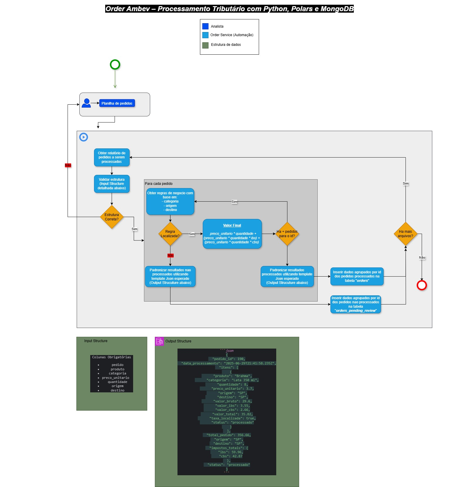

# 🧾 Order Ambev – Processamento Tributário com Python, Polars e MongoDB

Este projeto é um microserviço em **Python** que realiza o **processamento tributário de pedidos** com base em arquivos Excel, utilizando **Polars (Lazy)** para desempenho otimizado e **MongoDB** para persistência dos dados.

---

## 🎯 Objetivo

Desenvolver um serviço robusto e escalável para:

- 📥 Ler arquivos Excel contendo pedidos
- 🧮 Calcular os impostos (IBS e CBS) conforme a nova **reforma tributária**
- 📊 Agregar totais por pedido
- 💾 Persistir os resultados no **MongoDB**

---

## ⚙️ Funcionalidades

- ✅ Leitura eficiente de planilhas com **Polars Lazy**
- ✅ Cálculo item a item dos tributos (IBS e CBS)
- ✅ Validação de regras por **origem, destino e categoria**
- ✅ Agrupamento e somatório por pedido
- ✅ Armazenamento em coleções distintas para pedidos **processados** e **não processados**
- ✅ Arquitetura modular, ideal para ser estendida como microserviço REST

---

## 📁 Estrutura do Projeto

```text
order/
├── app.py                 # Entrada principal do sistema
├── config.py              # Configurações de ambiente (como URI do MongoDB)
├── db.py                  # Conexão e manipulação com MongoDB
├── models.py              # Modelo de estrutura de documento no banco
├── processor.py           # Processamento dos pedidos e cálculo dos impostos
├── tax_rules.py           # Regras de imposto por categoria/origem/destino
├── requirements.txt       # Lista de dependências
├── .env                   # Variáveis de ambiente (ex: MONGO_URI)
├── data/
│   └── pedidos.xlsx       # Planilha de pedidos de entrada
├── README.md              # Documentação do projeto
```

---

## ▶️ Como Executar

### 1. Configure o `.env`

Crie um arquivo `.env` com o seguinte conteúdo:

```dotenv
MONGO_URI=mongodb://localhost:27017
```

---

### 2. Prepare a planilha de entrada

Coloque sua planilha `.xlsx` na pasta `data/` com as seguintes colunas obrigatórias:

- `pedido_id`
- `produto`
- `categoria`
- `preco_unitario`
- `quantidade`
- `origem`
- `destino`

---

### 3. Execute o serviço

```bash
python app.py
```

Você verá logs como:

```
[2025-06-29 21:41:58] INFO: Lendo arquivo Excel...
[2025-06-29 21:42:01] INFO: Pedido 190 processado e inserido com sucesso.
[2025-06-29 21:42:03] INFO: ✔️ Total de pedidos processados: 872
[2025-06-29 21:42:03] INFO: ❌ Total de pedidos não processados: 128
```

---

### 4. Verifique no MongoDB

No terminal do MongoDB:

```js
use order_service
db.orders.find().pretty()
db.orders_review.find({ status: "nao processado" }).pretty()
```

---

## 💡 Exemplo de Documento Salvo

```json
{
  "pedido_id": 190,
  "data_processamento": "2025-06-29T21:41:58.235Z",
  "itens": [
    {
      "produto": "Brahma",
      "categoria": "Lata 350 ml",
      "quantidade": 8,
      "preco_unitario": 3.7,
      "origem": "SP",
      "destino": "SP",
      "valor_bruto": 29.6,
      "valor_ibs": 3.55,
      "valor_cbs": 2.66,
      "valor_total": 35.82,
      "taxa_localizada": true,
      "status": "processado"
    }
  ],
  "total_pedido": 356.66,
  "origem": "SP",
  "destino": "SP",
  "impostos_totais": {
    "ibs": 59.96,
    "cbs": 42.87
  },
  "status": "processado"
}
```

---

## 📚 Regras Tributárias

```python
PRODUCT_TAX_RULES = {
  "lata 350 ml": {
    ("SP", "SP"): {"ibs": 0.12, "cbs": 0.09},
    ("SP", "RJ"): {"ibs": 0.15, "cbs": 0.10},
    ("SP", "PR"): {"ibs": 0.09, "cbs": 0.08}
  },
  "garrafa 350 ml": {
    ("SP", "SP"): {"ibs": 0.05, "cbs": 0.02},
    ("SP", "RJ"): {"ibs": 0.07, "cbs": 0.03}
  },
  "lata 473 ml": {
    ("SP", "SP"): {"ibs": 0.00, "cbs": 0.00},
    ("SP", "RJ"): {"ibs": 0.01, "cbs": 0.01}
  },
  "lata sem alcool": {
    ("SP", "SP"): {"ibs": 0.10, "cbs": 0.40},
    ("SP", "RJ"): {"ibs": 0.12, "cbs": 0.45}
  }
}
```

---

## 🛠 Desenho Técnico


---

## 👤 Autor

| Nome             | Contato                             |
|------------------|--------------------------------------|
| Bruno Henrique   | 📧 bruno.dkhenrique@gmail.com         |
| [LinkedIn](https://linkedin.com/in/bruno-pereira-220522) | [GitHub](https://github.com/BrunoHPPereira/Order) |

---

## 📦 Requisitos

```bash
pip install -r requirements.txt
```

Inclui:
- `polars`
- `pymongo`
- `python-dotenv`
- `openpyxl`
